# 🔍 ProfileScan

**Universal Social Media Profile Viewer** – Find any username across 200+ platforms with one search. High accuracy with local backend proxy.

[](https://github.com/Aliriyaj007/ProfileScan/stargazers)
[](https://aliriyaj007.github.io/ProfileScan/)
[](LICENSE.txt)
[](https://aliriyaj007.github.io/ProfileScan/)
[](https://aliriyaj007.github.io/ProfileScan/)

## 📋 Quick Overview

ProfileScan solves a simple problem: **"Where does this username exist online?"** Enter a username → get results from 200+ social platforms in one dashboard. Uses a local helper to ensure 100% accuracy by bypassing CORS restrictions.

> [!IMPORTANT]  
> **Accuracy Disclaimer:** While we strive for accuracy, automated checks can occasionally be incorrect due to platform-specific anti-bot protections, rate limiting, or "soft 404" responses. **Please manually verify any critical results by visiting the actual profile link.**

## 🎯 Why This Exists

### The Problem

```mermaid
graph LR
    A[Find username online] --> B[Manual Search]
    B --> C[Visit each platform]
    C --> D[Type username]
    D --> E{Profile exists?}
    E -->|Yes| F[Bookmark/Note]
    E -->|No| G[Move to next]
    G --> C
    F --> H[Repeat 200x times]
    H --> I[🤯 Time wasted]
```


### The Solution

```mermaid
graph LR
    A[Enter username] --> B[ProfileScan]
    B --> C[Local Proxy Check]
    C --> D[Real status verification]
    D --> E[📊 Dashboard with stats]
    D --> F[🔗 Direct profile links]
    D --> G[📤 Export options]
    E --> H[✅ Accurate Results]
```


## 🚀 Get Started in 60 Seconds

### **Method 1: Local Setup (For Accuracy)**
To check actual profile existence (avoiding "Not Found" errors due to CORS), you need to run the lightweight local server.

```bash
# 1. Clone the repository
git clone https://github.com/Aliriyaj007/ProfileScan.git
cd ProfileScan

# 2. Install dependencies (First time only)
npm install

# 3. Start the server
npm start
```
**Then open `index.html` in your browser.** The app will automatically use the local server at `http://localhost:3000` to verify profiles.

### **Method 2: Static Usage (Limited)**
If you just want to generate links without verifying them:
1. Open `index.html` directly.
2. Search as normal.
*Note: Without the server, results are simulated and may not be accurate.*

## 🎨 Features

| Feature | Description | Benefit |
|---------|-------------|---------|
| **🔍 Universal Search** | One username → 200+ platforms | Saves hours of manual searching |
| **🎯 High Accuracy** | Real HTTP checks via local proxy | No more false positives/negatives |
| **🛡️ Private** | No external data collection | Your searches stay on your machine |
| **📊 Smart Dashboard** | Presence score, platform diversity, analytics | Understand digital footprint instantly |
| **🎨 7 Premium Themes** | Google-inspired, Dark, Ocean, Sunset, Forest, Midnight, Cyberpunk | Customize to your preference |
| **💾 Backup & Restore** | Export/import all settings and selections | Never lose your configuration |
| **📤 Multiple Export** | JSON, CSV, HTML reports | Use data anywhere |
| **⚡ Instant Results** | Progressive loading, real-time updates | See results as they come in |

## 🏗️ How It Works


## 📁 Project Structure

```
ProfileScan/
├── 📄 index.html              # Frontend application
├── 📄 server.js               # Node.js backend proxy
├── 📄 package.json            # Backend dependencies
├── 📱 200+ platforms          # Embedded platform database
├── 🎨 7 premium themes       # Complete theme system
├── 💾 LocalStorage engine    # Client-side data persistence
└── 📤 Export system          # JSON/CSV/HTML generation
```

## 🎯 Use Cases

| Who | Use Case | Benefit |
|-----|----------|---------|
| **👤 Recruiters** | Find candidate's online presence | Comprehensive background check |
| **🔒 Security Teams** | Identify impersonation accounts | Protect brand reputation |
| **📈 Digital Marketers** | Research competitor presence | Competitive analysis |
| **👥 HR Departments** | Verify employee social media | Company policy compliance |
| **🔎 Journalists** | Research subject's online activity | Investigative reporting |
| **👨‍💻 Developers** | Check username availability | Brand consistency |
| **👤 Individuals** | Personal digital footprint audit | Privacy management |

## ⚙️ Technical Details

### **Architecture**
- **Hybrid Approach**: Static HTML/JS frontend + Lightweight Node.js proxy.
- **Express.js Backend**: Handles cross-origin requests to check profile status codes.
- **Frontend**: Vanilla JS, no framework dependencies.
- **LocalStorage**: Settings persisted in browser.

### **Data Flow**
1. **Input**: Username entered in frontend.
2. **Request**: Frontend calls `http://localhost:3000/check?url=...`
3. **Proxy**: Server fetches the target profile page.
4. **Validation**: Checks HTTP status (200 OK vs 404) and text content (Soft 404 detection).
5. **Response**: Returns JSON `{ exists: true/false }`.

## 🔧 Advanced Usage

### **Custom Platform Addition**
Add your own platforms via Settings → Custom Platforms:
```json
{
  "name": "Your Platform",
  "url_pattern": "https://example.com/users/{username}",
  "category": "Custom"
}
```

### **Keyboard Shortcuts**
| Shortcut | Action |
|----------|--------|
| `Enter` | Start search (when enabled) |
| `/` | Focus search box |
| `Esc` | Close modals/panels |
| `Ctrl/Cmd + S` | Save current selection |
| `Ctrl/Cmd + E` | Export results |

## 🤝 Contributing

Contributions are welcomed. The project proves its value through utility, not marketing. If you find it useful and want to improve it:

### **How to Contribute**
1. **Fork** the repository
2. **Add** new platforms to `PLATFORM_DATABASE`
3. **Improve** UI/UX with Google-inspired design
4. **Optimize** performance for large searches
5. **Add** new export formats
6. **Create** better platform validation methods
7. **Translate** into other languages
8. **Fix** bugs or improve documentation

## 📄 License

**PERSONAL USE ONLY.**

This software is free for personal, non-commercial use.
Commercial use, redistribution, or selling of this software is **strictly prohibited**.

See [LICENSE.txt](LICENSE.txt) for full details.

**You are free to:**
- Use privately for personal audit
- Modify for personal learning

**You may NOT:**
- Use for business/commercial purposes
- Sell or redistribute
- Use for professional recruiting/investigation

**Riyajul Ali**  
Building practical tools that solve real problems.

| Platform | Link |
|----------|------|
| **GitHub** | [github.com/Aliriyaj007](https://github.com/Aliriyaj007) |
| **Email** | [aliriyaj007@protonmail.com](mailto:aliriyaj007@protonmail.com) |
| **LinkedIn** | [linkedin.com/in/Aliriyaj007](https://linkedin.com/in/Aliriyaj007) |
| **Web App** | [aliriyaj007.github.io/ProfileScan](https://aliriyaj007.github.io/ProfileScan/) |

## 📊 Stats & Adoption

```
📈 Project Metrics:
• 200+ platforms supported
• 7 premium themes
• Hybrid Architecture (Client + Node.js)
• 0 dependencies (Frontend)
• ∞ privacy
```

---

**⭐ If this saves you time, star the repo.**  
**🔧 If you can improve it, fork and contribute.**  
**🌐 If it's useful, use it daily.**

No hype. No begging. Just utility.

---